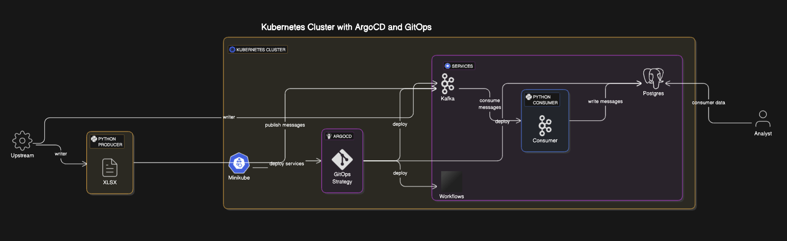

# etl-poc

An ETL infra setup with ArgoCD

## Installation

### Prerequisite

```
minikube
kubectl
make
terraform
```

### Install

Using the present `main.tf` file to setup

-   k8s cluster using minikube
-   Argo CD, from
    [official manifest](https://raw.githubusercontent.com/argoproj/argo-cd/stable/manifests/install.yaml)
-   Load a `application.yml` to initialize the CD

Run the following

```bash
make install
```

## Clean up

To clean up the k8s cluster and all created resources and files, just run

```bash
make clean
```

## Using and interacting with Argo

### Argo CI/CD UI

Once the pods are up and running, port forward the Argo services and fetch admin
credentials to access the UI. There is a UI for both `Argo CD` and `Argo Workflows`.

Run the following to start services

```bash
make start
```

To stop the services, run

```bash
make stop
```

If the UI's don't auto start, you will find Argo CD on https://localhost:8080/, and Argo
Workflow on https://localhost:2746/. All the commands are placed in the `maintenance`
directories as shell scripts.

## _Our_ Argo Architecture

Applications are continuously deployed with Argo CD. The applications are deployed using a
GitOps structure, where the _actual state_ is compared to the _desired state_ to identify
the need for updating the k8s resources.



### All other repos

-   [Kafka](https://github.com/phdah/etl-kafka)
-   [Postgres](https://github.com/phdah/etl-postgres)
-   [Workflows](https://github.com/phdah/etl-workflows)
